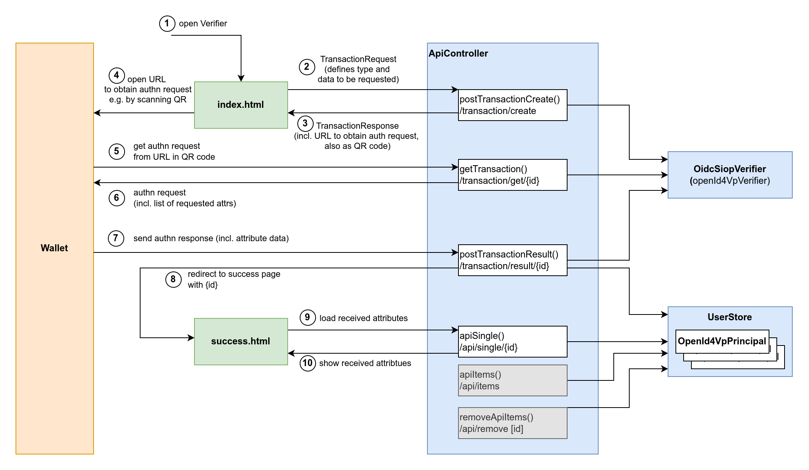

# Wallet Relying Party Demonstrator

This service is a demonstrator of a wallet relying party, requesting credentials from wallets using [OpenID for Verifiable Presentations](https://openid.net/specs/openid-4-verifiable-presentations-1_0.html).

It builds upon [Signum](https://github.com/a-sit-plus/signum) and [VC-K](https://github.com/a-sit-plus/vck).

This service is intended for demonstration purposes, and makes no guarantees to be correct and/or complete. It should never be used in production systems. All contents subject to change. See [A-SIT Plus Wallet](https://wallet.a-sit.at/) for more information.


## Overview: Process and Components



1. The user opens the `index.html` page in their browser, on the mobile phone or their PC/laptop.
2. The `index.html` page creates a `TransactionRequest` and sends it to the `ApiController`'s `/transaction/create`. In this demo, this request makes it possible to specify the parameters of the authentication: the `urlprefix` of the user's wallet, as well as the requested `credentialType`, `representation`, and `attributes`.
3. The `ApiController` answers with a `TransactionResponse`, which includes an initialization URL and a QR code encoding the same URL. Both are shown on the page.
4. The initialization URL is processed differently, depending on the type and location of the user's wallet.
    1. App Wallet on another device: The user scans the QR code on the different device to open it's wallet.
    2. App Wallet on the same device: The user clicks the link to open the wallet app on the same device
    3. Remote Wallet: The user clicks on the link to a remote wallet as a web-service in the same browser window (if no wallet app is installed on the same device).
5. While the initialization URL was used to initiate the wallet authentication, the wallet has yet to obtain the actual authn request. The wallet processes the initialization URL, extracts the encoded child URL (`ApiController`'s `/transaction/get/{id}`) and makes an request to that child URL.
6. The `ApiController` creates and returns an authn request according to the initially defined parameters (see step 2) by using the `OidcSiopVerifier`.
7. The wallet processes the authn request and presents credentials to satisfy the request. This presentation step usually involves the user's consent, authentication to unlock keys and cryptographic operations to demonstrate ownership of the disclosed data. The generated authn response is sent to an URL specified in the authn request: the `ApiController`'s `/transaction/result/{id}`.
8. The `ApiController` processes and verifies the presented authn response by using the `OidcSiopVerifier`. It stores the user's data in the `UserStore` and forward's the user's browser to the `success.html` page.
9. The `success.html` page loads the data presented by the user via a call to `ApiController`'s `/api/single/{id}`.
10. The `ApiController` returns the user's data from the `UserStore`, which is then shown on the `success.html` page.


## Deployment

This service uses Spring Boot, so one can start the service with  `./gradlew bootRun`.

When deploying this service (i.e. executing the `jar` produced by `./gradlew bootJar`), `application.yml` may look like this:
```yaml
app:
  public-url: https://example.com/verifier
server:
  port: 8080
  servlet:
    context-path: /verifier
  forward-headers-strategy: framework
```
